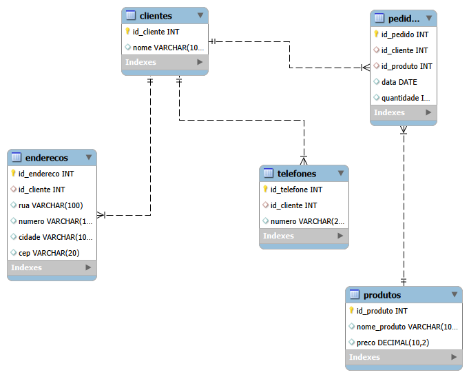
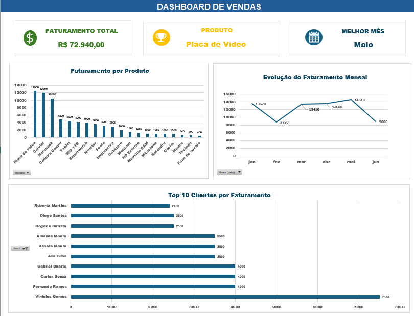
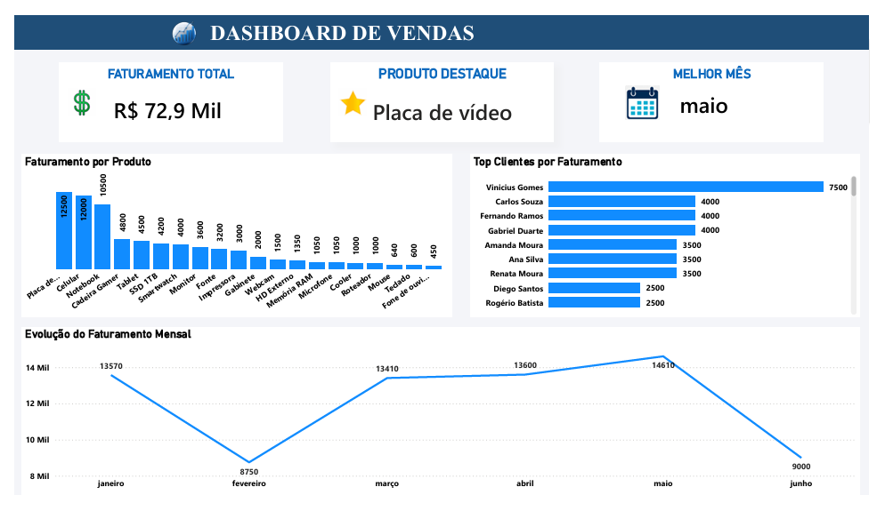

# 📊 Projeto de Análise de Dados

Projeto desenvolvido para praticar modelagem de dados, SQL e análise de dados em um cenário de loja.

## ⚙️ Tecnologias utilizadas

- MySQL
- SQL
- MySQL Workbench
- Excel
- Power Query
- Power Bi
- Git e GitHub

## 📂 Estrutura do projeto

/modelagem → modelo relacional do banco de dados /scripts → consultas SQL /
excel → dashboard e análises em Excel /powerbi → dashboard desenvolvido no Power BI

## 📌 Modelagem do Banco

## 📊 Consultas realizadas

- faturamento total
- produtos mais vendidos
- clientes que mais compraram
- pedidos por mês

## 📈 Dashboard em Excel

O projeto inclui um dashboard desenvolvido no Excel utilizando Power Query, Tabelas Dinâmicas e Gráficos Dinâmicos.

Principais indicadores

- Faturamento Total
- Produto Destaque
- Melhor Mês de Vendas

Principais análises

- Faturamento por Produto
- Top 10 Clientes por Faturamento
- Evolução do Faturamento Mensal

## 📊 Dashboard em Power BI

Dashboard interativo desenvolvido no Power BI para análise de desempenho de vendas.

Indicadores

- Faturamento Total
- Produto Destaque
- Melhor Mês de Vendas
  
Análises

- Faturamento por Produto
- Top Clientes por Faturamento
- Evolução do Faturamento Mensal

## 🚀 Competências Demonstradas

- Modelagem de Banco de Dados
- Consultas SQL
- Análise Exploratória de Dados
- Tratamento de Dados com Power Query
- Criação de Dashboards em Excel
- Criação de Dashboards em Power BI
- Versionamento com Git e GitHub

👨‍💻 Autor: Lucas Lemos Silva

🔗 LinkedIn: https://www.linkedin.com/in/lucasanalytics/

🔗 GitHub: https://github.com/LucasLemos-Analytics
